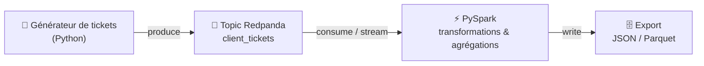

# Modélisez une infrastructure dans le cloud

> Projet **Data Engineer** — OpenClassrooms.
> Conception d'une **infrastructure de données hybride** (on-premise ↔ cloud / services Redpanda) et POC d'un
> **pipeline ETL temps réel** de gestion de tickets clients avec **Redpanda + PySpark**, le tout
> conteneurisé avec **Docker**.

📄 **Consignes complètes :** [`consigne.md`](consigne.md)
🗺️ **Plan de travail collaboratif :** [`docs/plan-conversations.md`](docs/plan-conversations.md)

---

## 🎯 Objectif

L'entreprise fictive **InduTechData** veut moderniser sa gestion de données (IoT, +50 Go/mois en
temps réel) en s'appuyant sur le cloud (**services Redpanda**, conformément à la consigne d'action)
**sans casser** son SI on-premise existant (SQL Server, SAN, Active Directory, ERP/CRM). Le projet
se découpe en deux exercices :

1. **Exercice 1 — Modélisation** d'une architecture hybride + évaluation de compatibilité.
2. **Exercice 2 — POC** d'un pipeline ETL temps réel (tickets clients) : Redpanda → PySpark →
   export, conteneurisé et documenté.

---

## 🧱 Stack technique

| Domaine | Outil |
|---|---|
| Streaming / ingestion temps réel | **Redpanda** (compatible Kafka) |
| Traitement distribué (ETL) | **Apache Spark / PySpark** |
| Langage | **Python 3.12** |
| Conteneurisation / orchestration | **Docker + Docker Compose** |
| Formats d'export | **JSON / Parquet** |
| Schéma d'architecture | **SVG** (export PDF/PNG via navigateur / Edge headless) |
| Schéma de flux (pipeline) | **Mermaid** (dans ce README) |

---

## 📂 Structure du dépôt

```
.
├── README.md                       # Ce fichier (= livrable doc Exercice 2)
├── consigne.md                     # Consignes officielles complètes
├── docs/
│   ├── plan-conversations.md       # Plan collaboratif (Conversations A → F)
│   └── exercice1-modelisation/     # Schéma d'archi + doc d'évaluation de compatibilité
├── src/                            # Code Python (producteur de tickets, traitement PySpark)
├── docker/                         # Dockerfiles + docker-compose.yml
├── data/                           # Données / exports (JSON, Parquet) — ignoré par git
├── screenshots/                    # Captures d'écran prises pendant le projet
└── livrables/                      # Livrables finaux nommés/zippés pour le dépôt OC
```

---

## 🚀 Démarrage rapide

> ⏳ Sera complété au fil des conversations (commandes Docker Compose, etc.).

```bash
# À venir (Conversation E) :
# docker compose -f docker/docker-compose.yml up --build
```

---

## 🔀 Schéma de flux du pipeline ETL (Mermaid)

> ⏳ Diagramme **Mermaid** à finaliser en **Conversation F** (livrable Exercice 2).



---

## 🎬 Vidéo de démonstration

> ⏳ Lien à ajouter en **Conversation F** (YouTube / Loom).

---

## 📊 Avancement du projet

Légende : ⬜ à faire · 🟦 en cours · ✅ terminé

### Phase 0 — Cadrage & setup
- ✅ Récupération et synthèse des consignes officielles ([`consigne.md`](consigne.md))
- ✅ Création du dépôt + structure + plan de conversations
- ✅ Vérification de l'environnement (Docker 29 + Compose v5, Python 3.12) — *Conversation A validée*

### Exercice 1 — Modélisation de l'architecture hybride
- ✅ Identifier et sélectionner les composants cloud **Redpanda** (mapping on-premise → cloud) — voir [`evaluation-compatibilite.md`](docs/exercice1-modelisation/evaluation-compatibilite.md#2-composants-retenus-et-justification)
- 🟦 Réaliser le **schéma d'architecture hybride** — source [`architecture-hybride.svg`](docs/exercice1-modelisation/architecture-hybride.svg) faite ; export **PDF/PNG** à générer
- ✅ Rédiger le **document d'évaluation de compatibilité** (sécurité, interopérabilité, coûts) — [`evaluation-compatibilite.md`](docs/exercice1-modelisation/evaluation-compatibilite.md)

### Exercice 2 — Pipeline ETL temps réel
- ⬜ **Étape 1** — Cluster Redpanda + topic `client_tickets` + producteur Python
- ⬜ **Étape 2** — Traitement PySpark (lecture topic, transformations, agrégations)
- ⬜ **Étape 3** — Export des résultats (JSON / Parquet)
- ⬜ **Étape 4** — Conteneurisation (Dockerfiles + docker-compose)
- ⬜ **Étape 5** — Documentation (README + Mermaid + vidéo)

### Finalisation
- ⬜ Fiche d'autoévaluation complétée
- ⬜ Livrables nommés + zippés selon la convention
- ⬜ Session de bilan avec le mentor

---

## 📝 Convention de nommage des livrables

Dépôt dans un zip `Titre_du_projet_nom_prenom`, fichiers nommés
`Nom_Prenom_n°_nom_du_livrable_mmaaaa` (voir [`consigne.md`](consigne.md#6-récapitulatif-des-livrables-à-déposer)).
