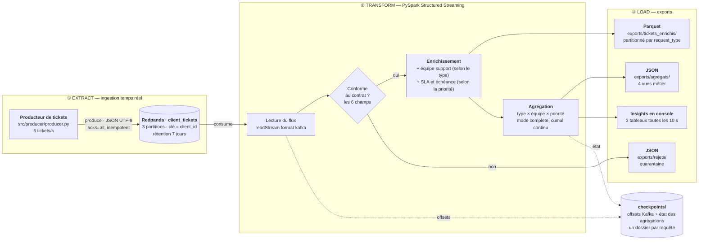

# Modélisez une infrastructure dans le cloud

Projet Data Engineer — OpenClassrooms.

Conception d'une infrastructure de données hybride (on-premise ↔ cloud) et POC d'un pipeline ETL
temps réel de gestion de tickets clients avec Redpanda + PySpark, conteneurisé avec Docker.

Consignes complètes : [`consigne.md`](consigne.md).

## Contexte

L'entreprise InduTech veut moderniser sa gestion de données (IoT, plus de 50 Go/mois en temps réel)
en s'appuyant sur le cloud, sans casser son SI on-premise existant : SQL Server, SAN, Active
Directory, ERP/CRM. Le projet se découpe en deux exercices indépendants.

| | Exercice | Nature | Livrables |
|---|---|---|---|
| 1 | Modélisation d'une infrastructure hybride | Sur le papier — rien n'est déployé | [Schéma d'architecture](docs/exercice1-modelisation/architecture-hybride.pdf) + [évaluation de compatibilité](docs/exercice1-modelisation/evaluation-compatibilite.md) |
| 2 | POC d'un pipeline ETL temps réel | Exécutable — tourne en local sous Docker | Ce dépôt de code + le schéma de flux ci-dessous + la vidéo de démonstration |

L'Exercice 2 simule l'usage cloud en local, comme le demande explicitement la consigne
(« on vous demande de simuler l'utilisation de Redpanda avec votre POC »).

---

# Exercice 1 — Modélisation de l'infrastructure hybride

| Livrable | Fichier |
|---|---|
| Schéma d'architecture hybride | [`architecture-hybride.pdf`](docs/exercice1-modelisation/architecture-hybride.pdf) · [`.png`](docs/exercice1-modelisation/architecture-hybride.png) · [source SVG](docs/exercice1-modelisation/architecture-hybride.svg) |
| Évaluation de compatibilité | [`evaluation-compatibilite.md`](docs/exercice1-modelisation/evaluation-compatibilite.md) · [`.pdf`](docs/exercice1-modelisation/evaluation-compatibilite.pdf) |
| Hypothèses de chiffrage | [`annexe-couts.md`](docs/exercice1-modelisation/annexe-couts.md) |

L'architecture retenue conserve le SI existant et le prolonge par des services AWS reliés en liaison
privée : S3 pour le stockage objet, Redshift Serverless comme entrepôt, Redpanda Cloud BYOC pour le
streaming, AWS Managed Microsoft AD en relation d'approbation avec l'annuaire d'entreprise, DataSync
pour la reprise du SAN et Direct Connect pour la liaison. Les 40 To de SQL Server ne sont pas migrés :
un connecteur CDC publie les changements des seules tables ERP/CRM utiles.

---

# Exercice 2 — Le pipeline ETL

## Schéma de flux du pipeline



Les trois requêtes streaming tournent en parallèle, chacune avec son propre checkpoint : le flux
détaillé enrichi, les agrégations, et la quarantaine. Aucune ne peut bloquer les autres.

Les flèches en pointillés sortent du flux de données. Les checkpoints ne transportent rien vers
l'aval : ils persistent à chaque micro-batch les offsets Kafka déjà consommés et l'état des
agrégations. C'est ce qui permet à un traitement relancé de repartir exactement où il s'était
arrêté, sans rien reperdre ni recompter.

## Prérequis

Une seule chose à installer : [Docker Desktop](https://www.docker.com/products/docker-desktop/).

| Besoin | Version | Où |
|---|---|---|
| Docker Engine | ≥ 27 (validé sur 29.6) | sur votre machine |
| Docker Compose | v2 (validé sur v5.3) | fourni avec Docker Desktop |
| RAM disponible | ≈ 4 Go pour Docker | Spark tourne avec 2 Go de driver |

Ni Python, ni Java, ni Spark ne sont requis sur la machine. Tout s'exécute dans les conteneurs :
l'image Spark officielle embarque le JRE et PySpark, et notre Dockerfile y ajoute les JARs du
connecteur Kafka. C'est un choix délibéré — le POC démarre sur un poste vierge.

## Démarrage rapide

Depuis la racine du dépôt :

```bash
docker compose -f docker/docker-compose.yml up --build
```

Une seule commande construit les trois images, démarre le broker, crée le topic, lance le producteur
et démarre le traitement Spark, dans le bon ordre.

Comptez 2 à 4 minutes au tout premier lancement, le temps de construire les images et de télécharger
les JARs du connecteur Kafka. Ensuite, images en cache, c'est bien plus rapide : mesuré à 10 s pour
que les 5 services soient démarrés, et 27 s entre la commande et le premier tableau d'insights.

### Ce que vous devez voir

Au bout d'une trentaine de secondes, les logs affichent des tableaux d'insights qui se rafraîchissent
toutes les 10 secondes :

```
==============================================================================
  INSIGHTS — micro-batch 1 — 9996 ticket(s) traités depuis le début
==============================================================================
  Tickets par type de demande et équipe assignée
+------------+------------------------+----------+
|request_type|equipe_support          |nb_tickets|
+------------+------------------------+----------+
|livraison   |Logistique & Expéditions|2063      |
|commercial  |Équipe Commerciale      |2005      |
|compte      |Support Comptes & Accès |1991      |
|facturation |Service Facturation     |1984      |
|technique   |Support Technique N2    |1953      |
+------------+------------------------+----------+
```

| À vérifier | Où |
|---|---|
| Les tickets arrivent dans le topic | <http://localhost:8080> → Topics → `client_tickets` → onglet Messages |
| Le topic a bien 3 partitions | <http://localhost:8080> → Topics → `client_tickets` → Partitions |
| Spark consomme en continu | <http://localhost:4040> → onglet Structured Streaming → 3 requêtes actives |
| Les insights défilent | `docker compose -f docker/docker-compose.yml logs -f spark` |
| Les exports se remplissent | le dossier `data/` apparaît à la racine du dépôt |

### Les services démarrés

| Service | Conteneur | Rôle | Exposé sur |
|---|---|---|---|
| `redpanda` | `redpanda` | Le broker (API Kafka native) | `localhost:19092` · admin `9644` |
| `topic-init` | `redpanda-topic-init` | Crée `client_tickets` puis s'arrête. Sortir en code 0 est le comportement normal. | — |
| `console` | `redpanda-console` | Interface web du broker | <http://localhost:8080> |
| `producteur` | `ticket-producteur` | Génère et publie les tickets | — |
| `spark` | `spark-tickets` | Le traitement PySpark | <http://localhost:4040> |

### Régler le débit et la cadence

Sous PowerShell — attention, PowerShell n'accepte pas le préfixe `VAR=valeur` :

```powershell
$env:PRODUCER_RATE=50; docker compose -f docker/docker-compose.yml up --build
```

Sous bash ou zsh (Linux, macOS, Git Bash) :

```bash
PRODUCER_RATE=50 SPARK_TRIGGER_SECONDS=5 docker compose -f docker/docker-compose.yml up --build
```

| Variable | Défaut | Effet |
|---|---|---|
| `PRODUCER_RATE` | `5` | Tickets produits par seconde |
| `PRODUCER_MAX_MESSAGES` | `0` | Nombre total de tickets, `0` = flux illimité |
| `SPARK_TRIGGER_SECONDS` | `10` | Période des micro-batchs Spark |
| `SPARK_DRIVER_MEMORY` | `2g` | Mémoire du driver Spark |

### Arrêter

```bash
docker compose -f docker/docker-compose.yml down
```

```bash
docker compose -f docker/docker-compose.yml down -v
```

Le premier arrête tout en conservant le topic et les exports. Le second ajoute la suppression des
volumes : on repart d'un état totalement vierge.

Le service `spark` sort en code 143 à l'arrêt, et c'est normal : sous `spark-submit`, le processus
n°1 du conteneur est la JVM, qui intercepte le signal d'arrêt. Aucune donnée n'est perdue, les
checkpoints sont validés à chaque micro-batch.

## Les insights produits

### Ce que le pipeline calcule

Deux transformations, appliquées ticket par ticket :

| Transformation | Règle | Pourquoi |
|---|---|---|
| Équipe support | Déduite du `request_type` (5 types → 5 équipes) | C'est l'exemple cité par la consigne : router automatiquement le ticket vers la bonne équipe. |
| SLA et échéance | Déduits de la `priority` : 2 h / 8 h / 24 h / 72 h | Compter les tickets ne dit pas lesquels risquent de déraper. L'échéance est calculée par ticket. |

Une agrégation (`request_type` × `equipe_support` × `priority`), dont quatre vues sont exportées :

| Vue | Contenu | Lecture |
|---|---|---|
| `par_type/` | Nombre de tickets par type de demande et équipe assignée | Quel canal génère le plus de sollicitations |
| `par_priorite/` | Nombre de tickets par priorité | La pyramide d'urgence |
| `par_equipe/` | Volume, nombre de critiques et part de critiques par équipe | Le seul vraiment actionnable : à volume égal, deux équipes ne sont pas sous la même pression |
| `detail_type_priorite/` | Le croisement complet, avec le nombre approximatif de clients distincts | La donnée brute pour rejouer n'importe quelle autre vue |

### Où atterrissent les résultats

```
data/
├── exports/
│   ├── tickets_enrichis/       ← Parquet, le flux détaillé enrichi
│   │   ├── request_type=facturation/
│   │   ├── request_type=technique/
│   │   └── …                     (un dossier par type)
│   ├── agregats/               ← JSON, réécrit à chaque micro-batch
│   │   ├── par_type/  par_priorite/  par_equipe/  detail_type_priorite/
│   └── rejets/                 ← JSON, quarantaine (vide si tout est conforme)
└── checkpoints/                ← état de reprise Spark, un dossier par requête
```

Exemple de `agregats/par_priorite/` :

```json
{"priority":"critique","nb_tickets":1475}
{"priority":"haute","nb_tickets":3063}
{"priority":"moyenne","nb_tickets":4458}
{"priority":"basse","nb_tickets":5913}
```

Le choix de deux formats est délibéré. Le Parquet est colonnaire, compressé et typé : il se lit
directement dans pandas, DuckDB, Power BI ou Athena — c'est la visualisation ultérieure demandée par
la consigne. Le JSON des agrégats est petit et lu par un humain : il s'ouvre dans n'importe quel
éditeur.

Lire les exports Parquet depuis Python :

```bash
python -c "import pandas as pd; print(pd.read_parquet('data/exports/tickets_enrichis').head())"
```

## Performance et résilience

Ce sont les deux points de vigilance de la consigne. Voici où ils sont traités.

### Performance

| Réglage | Valeur | Pourquoi |
|---|---|---|
| `spark.sql.shuffle.partitions` | 3 | Aligné sur les 3 partitions du topic. Le défaut de 200 ferait brasser 197 partitions vides à chaque agrégation. |
| `--driver-memory` | 2 g | En `local[*]`, tout le travail se fait dans la JVM du driver : le défaut de 1 Go est juste. |
| `maxOffsetsPerTrigger` | 5000 | Plafonne un micro-batch. Sans lui, un premier passage sur un topic déjà rempli engloutit tout l'historique d'un coup. |
| JARs Kafka dans l'image | — | `--packages` relance une résolution Ivy à chaque démarrage (des dizaines de secondes) et échoue sans Internet. |

### Résilience

| Mécanisme | Ce qu'il couvre |
|---|---|
| Checkpoints par requête | Un job relancé repart où il s'était arrêté — offsets Kafka et état des agrégations. Vérifié : après un arrêt brutal, le traitement reprend au micro-batch 6, pas 0. |
| Quarantaine | Un message malformé n'interrompt pas le pipeline : il part dans `rejets/` avec son motif et sa position exacte dans le topic. |
| Repli sur type inconnu | Un `request_type` hors énumération n'est pas rejeté — le ticket reste exploitable, marqué `ÉQUIPE_INCONNUE`. |
| `failOnDataLoss=false` | Le topic a 7 jours de rétention. Après un arrêt plus long, le job repart au plus ancien offset disponible au lieu de refuser de démarrer. |
| Reprise bornée | 3 tentatives à délai croissant après une coupure du broker. Bornée à dessein : au-delà, l'incident est structurel et doit rester visible. |
| Producteur idempotent | `acks=all` + `enable.idempotence` : pas de doublon en cas de nouvelle tentative réseau. |

## Le contrat de données

Tout ce qui circule entre les composants est figé dans deux documents, ce qui a permis de développer
le producteur, le traitement et la conteneurisation en parallèle :

| Document | Ce qu'il fige |
|---|---|
| [`docs/contrat-ticket.md`](docs/contrat-ticket.md) | Le schéma JSON du ticket, les énumérations, le topic, les ports du broker |
| [`docs/contrat-export.md`](docs/contrat-export.md) | L'image Spark, les chemins et formats d'export, les checkpoints |

Le ticket comporte exactement les 6 champs imposés par la consigne, sans champ supplémentaire :

```json
{
  "ticket_id": "3f2b1c8e-9d41-4a7f-b0c5-6e8a2d1f4b93",
  "client_id": "CLI-00327",
  "created_at": "2026-08-14T09:23:41.512Z",
  "request": "Le capteur IoT de la ligne 3 ne remonte plus de mesures depuis ce matin.",
  "request_type": "technique",
  "priority": "critique"
}
```

`request_type` ∈ {`facturation`, `technique`, `commercial`, `compte`, `livraison`} ·
`priority` ∈ {`critique`, `haute`, `moyenne`, `basse`}

## Dépannage

| Symptôme | Cause probable | Solution |
|---|---|---|
| `redpanda-topic-init` est « Exited (0) » | Ce n'est pas une erreur — ce service crée le topic puis s'arrête. | Rien à faire. |
| Le producteur boucle sur « Broker injoignable » | Le broker n'est pas encore prêt, ou une adresse interne/externe est confondue. | Depuis un conteneur c'est `redpanda:9092`, depuis l'hôte `localhost:19092`. |
| `spark` sort en code 143 | Arrêt demandé — la JVM intercepte le signal. | Comportement normal, aucune donnée perdue. |
| « Port is already allocated » | Un cluster Redpanda tourne déjà (par exemple `docker/redpanda/compose.yml`). | `docker compose -f docker/redpanda/compose.yml down` d'abord. |
| `Current batch is falling behind` | Spark rattrape un retard accumulé dans le topic. | Se résorbe seul. Sinon augmenter `SPARK_TRIGGER_SECONDS`. |
| `File …/15.delta does not exist` puis arrêt de Spark | Un arrêt brutal est tombé pendant l'écriture de l'état des agrégations : le point de reprise est incomplet. | `rm -rf data/checkpoints/agregats` puis relancer. Le traitement repart du début du topic — aucune donnée perdue, elle est toujours dans Redpanda. |
| `exception while executing the Python Proxy` à l'arrêt | Bruit de fin de vie de la JVM qui coupe le pont avec Python. | Sans conséquence, à l'arrêt uniquement. |
| Les accents s'affichent mal dans les JSON | Le lecteur, pas le fichier. PowerShell 5.1 lit en ANSI par défaut. | `Get-Content -Encoding UTF8 fichier.json` |
| Repartir totalement de zéro | — | `docker compose -f docker/docker-compose.yml down -v` puis supprimer `data/`. |

## Vidéo de démonstration

[Démonstration du pipeline ETL (YouTube)](https://youtu.be/1Gm1b4aFUfU)

## Stack technique

| Domaine | Outil | Version |
|---|---|---|
| Streaming / ingestion temps réel | Redpanda (API Kafka native) | v26.2.1 |
| Interface web du broker | Redpanda Console | v3.10.0 |
| Traitement distribué (ETL) | Apache Spark / PySpark Structured Streaming | 3.5.6 (Scala 2.12) |
| Connecteur | `spark-sql-kafka-0-10_2.12` | 3.5.6 |
| Client Kafka côté producteur | confluent-kafka (librdkafka) | ≥ 2.5 |
| Langage | Python | 3.12 |
| Conteneurisation / orchestration | Docker + Docker Compose | 29 / v5 |
| Formats d'export | Parquet (snappy) · JSON | — |
| Schéma d'architecture (Ex. 1) | SVG → export PDF/PNG | — |
| Schéma de flux (Ex. 2) | Mermaid, dans ce README | — |

## Structure du dépôt

```
.
├── README.md                       # Ce fichier (= livrable documentation Exercice 2)
├── consigne.md                     # Consignes officielles complètes
├── docs/
│   ├── contrat-ticket.md           # Contrat de données : ticket, topic, broker
│   ├── contrat-export.md           # Contrat de données : exports, checkpoints, runtime Spark
│   └── exercice1-modelisation/     # Schéma d'architecture + évaluation de compatibilité
├── src/
│   ├── producer/producer.py        # Étape 1 — génère et publie les tickets
│   └── spark/streaming_tickets.py  # Étape 2 — lit, transforme, agrège, exporte
├── docker/
│   ├── docker-compose.yml          # Étape 4 — orchestre les 5 services
│   ├── redpanda/                   # Dockerfile du broker + amorçage du topic
│   ├── producteur/Dockerfile
│   └── spark/Dockerfile
├── data/                           # Étape 3 — exports et checkpoints (ignoré par git)
├── screenshots/                    # Captures d'écran prises pendant le projet
└── livrables/                      # Livrables finaux nommés/zippés pour le dépôt OC
```
